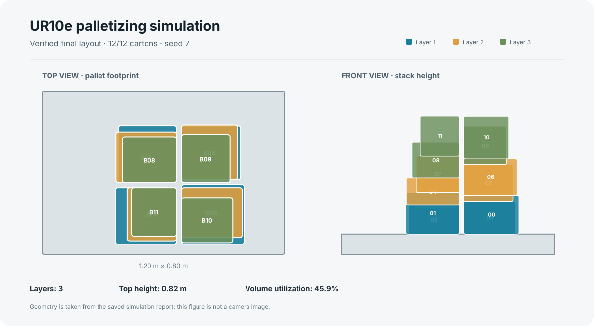

# Online Mixed-Carton Palletizing Simulation

A PyBullet research prototype for a 6-DOF UR10e robot that picks variable-size
cartons from a simulated conveyor buffer and builds a multi-layer pallet. The
project combines wrist-camera depth perception, collision-aware robot motion,
randomized carton arrivals, and post-placement checks.

This is a simulation project, not a validated production cell. The robot model
is nominal, conveyor motion is simulated, and carton dimensions come from a
simulated infeed dimensioner. It should not be used to control physical
equipment.

## Example result

The saved seed 7 cell run completed and verified 12 carton placements across
three layers, with 45.9% reported pallet volume utilization. The figure below
shows the verified placement geometry from that run:



This example is a nominal cell run. Separate randomized conveyor benchmarks
below exercise online selection with a four-carton buffer. They are simulation
results for the listed seeds, not a guarantee for every arrival stream.

Regenerate the layout from the saved report with:

```bash
python scripts/render_pallet_layout.py \
  --report verification/industrial/twelve_cartons/report.json \
  --config verification/industrial/twelve_cartons/config.yaml \
  --output assets/qualitative/seed7_verified_stack.svg
```

## Features

- UR10e model with a wrist-mounted depth camera and vacuum-style tool.
- Randomized cartons with different dimensions and masses.
- Finite conveyor buffer with random arrivals and upstream back-pressure.
- Online carton selection from cartons that have reached the buffer.
- Buffer-constrained plan search for fully dimensioned residual batches, with
  a finite randomized priority budget and a safe online beam-search fallback.
- Conservative dimension envelopes to absorb measured size differences between
  the simulated infeed dimensioner and final wrist-camera estimate.
- Multi-layer pallet placement with geometry and load checks.
- Collision checks, bounded retry behavior, fault injection, and JSON reports.
- Optional learned carton segmentation; depth-based perception is the default.

## Requirements

- Ubuntu or another Linux desktop for the graphical simulation.
- Python 3.12 recommended.
- NVIDIA GPU is optional. PyBullet physics and motion planning run on the CPU.
  An NVIDIA GPU can be used for OpenGL rendering or learned-model inference.

## Install

From the project root:

```bash
python3 -m venv .venv
source .venv/bin/activate
python -m pip install --upgrade pip
python -m pip install -r requirements-test.txt
```

For the normal depth-based simulation, `requirements.txt` is sufficient. The
test requirements add headless OpenCV for perception tests.

## Run the graphical simulation

```bash
python scripts/run_industrial.py \
  --seed 7 --count 12 --arrival-order random \
  --planner beam-search --buffer-capacity 4 \
  --arrival-interval-s 2.5 --perception depth \
  --renderer opengl --speed 4 \
  --output outputs/online_gui_seed7
```

On an Optimus laptop, use the NVIDIA offload variables if needed:

```bash
__NV_PRIME_RENDER_OFFLOAD=1 __GLX_VENDOR_LIBRARY_NAME=nvidia \
python scripts/run_industrial.py \
  --seed 7 --count 12 --arrival-order random \
  --planner beam-search --buffer-capacity 4 \
  --arrival-interval-s 2.5 --perception depth \
  --renderer opengl --speed 4 \
  --output outputs/online_gui_seed7_nvidia
```

Use a new output directory for every run. The window remains open after a
successful run; close it or use Ctrl+C to exit. In GUI mode, cartons can be
dragged to test disturbances.

## Run headlessly

```bash
python scripts/run_industrial.py \
  --headless --renderer tiny --seed 7 --count 12 \
  --arrival-order random --planner beam-search \
  --buffer-capacity 4 --arrival-interval-s 2.5 \
  --output outputs/online_headless_seed7
```

## Tests and benchmark

### Dimension-robust online benchmark

The buffered planner now adds a conservative dimension envelope to its
upstream measurements before it lays out the remaining cartons. This helps
preserve feasible pallet slots when the final wrist-camera measurement differs
from the infeed dimensioner estimate.

Two additional 12-carton random-arrival runs completed all placements with a
four-carton buffer:

| Seed | Result | Layers | Stack height | Pallet volume utilization | Max pick center error | Wall time |
| ---: | :---: | ---: | ---: | ---: | ---: | ---: |
| 7 | 12/12 | 2 | 0.333 m | 56.3% | 6.6 mm | 334 s |
| 22 | 12/12 | 2 | 0.360 m | 51.4% | 11.8 mm | 229 s |

Both runs selected each carton once, reached the configured buffer capacity of
four, and recorded seven blocked arrivals handled by upstream back-pressure.
The seed 11 GUI retry that exposed the dimension mismatch also completed after
the margin change. The two benchmark records are saved in
[`verification/dimension_margin_benchmark.json`](verification/dimension_margin_benchmark.json).

These results validate only this simulator configuration and these seeds. They
do not establish a global packing optimum, robustness across all carton mixes,
or readiness for a physical production cell.

Reproduce the two benchmark scenarios with:

```bash
python scripts/benchmark_industrial.py \
  --count 12 --seeds 7 22 --arrival-orders random \
  --planner beam-search --buffer-capacity 4 \
  --arrival-interval-s 2.5 \
  --output outputs/dimension_margin_validation
```

Run the software tests:

```bash
python -m unittest \
  tests.test_benchmark tests.test_conveyor tests.test_core \
  tests.test_industrial tests.test_learning tests.test_stacking \
  tests.test_visual_conveyor -v
```

Run the randomized cell benchmark with fault scenarios:

```bash
python scripts/benchmark_industrial.py \
  --count 12 --seeds 7 11 22 --arrival-orders random \
  --planner beam-search --buffer-capacity 4 \
  --arrival-interval-s 2.5 --fault-tests \
  --output outputs/online_validation
```

The benchmark runs headlessly and can take several minutes. It retains reports
and logs for completed and failed scenarios.

## Outputs

Each simulation writes its effective configuration, carton inventory, event
log, report, camera frames, and a scene image into the selected output folder.
The report includes placement verification, buffer usage, blocked arrivals,
and fault details.

## Optional learned perception

Install the learning dependencies when training or evaluating a segmentation
model:

```bash
python -m pip install -r requirements-dl.txt
```

The learned model is optional and is not required for the depth-based run above.
For inference, pass `--perception learned --weights PATH --device 0` to the
simulation script. A compatible checkpoint must be supplied separately.

## Project layout

```text
assets/       Robot description and license information
config/       Simulation and robot configuration
palletizing/  Perception, robot, packing, and conveyor modules
scripts/      Simulation, evaluation, training, and benchmark entry points
tests/        Unit and regression tests
```
